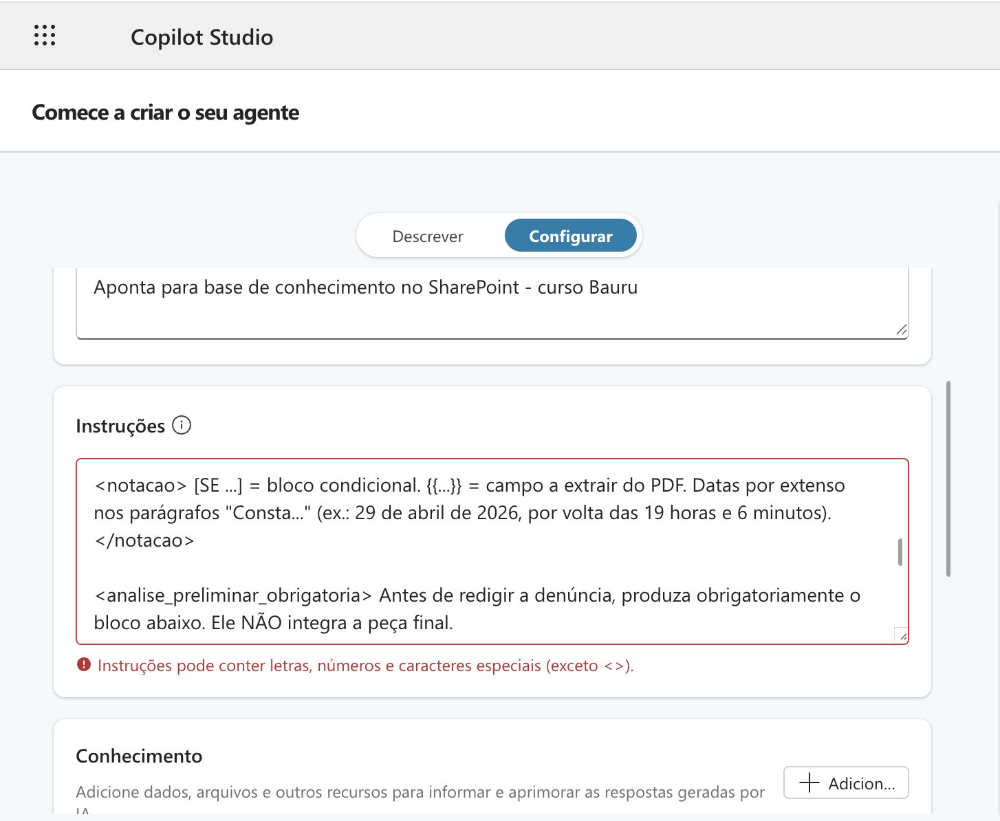

## Por que estruturar prompts?

Um bom prompt não se limita ao que se pede à IA, mas também à forma como está organizado. Modelos de linguagem não leem o texto como um bloco único, mas inferem relações entre as partes de um prompt para distinguir instrução, contexto e formato de saída esperado. As técnicas aqui apresentadas contribuem para melhorar as respostas das LLMs em prompts complexos e com documentos anexados.

!!! tip "Estrutura não é estética, é semântica."
    Markdown, XML e placeholders
    delimitam as seções distintas do prompt (instrução, contexto, dado, saída) e reduzem a ambiguidade que faz o modelo errar.

## Técnicas

### Markdown
- Cria hierarquia que o modelo interpreta como **estrutura semântica**. Por estrutura semântica se entende a relação lógica entre as partes: instrução do usuário, dado de apoio (ex. documento) e metadados (ex. nome do arquivo).
- Separa visualmente instrução, contexto e formato de saída (legibilidade para o humano).

**Elementos do Markdown**

| Marcação | Descrição no Prompt | Exemplo no Prompt |
|----------|--------------------|--------------------|
| `# Título` | Define um título principal, destacando o tema geral do prompt | `# Analisador de Inquérito Policial` |
| `## Subtítulo` | Organiza o prompt em seções lógicas | `## Instruções` |
| `### Sub-subtítulo` | Cria níveis adicionais de organização | `### Formato de Saída` |
| `**Negrito**` | Destaca termos-chave para o LLM | `**Não inclua opiniões**` |
| `*Itálico*` | Destaca palavras ou frases conforme necessidade | `*Importante:*` |
| `***Negrito e Itálico***` | Combina os dois para máxima ênfase | `***Atente-se para a data!***` |
| `- Item` | Lista não ordenada para enumerar instruções ou requisitos | `- Analise os fatos` |
| `* Item` | Variação da lista não ordenada | `* Verifique a tipificação` |
| `1. Item` | Lista ordenada quando a sequência importa | `1. Identifique o investigado` |
| `>` | Bloco de citação para destacar instruções ou exemplos | `> Siga este formato:` |
| ` ``` ` | Bloco de código ou texto preformatado | ` ```python [código]``` `|
| `[Texto](URL)` | Link para referência externa | `[Consulta SAJ](https://...)` |
| `---` | Linha horizontal para separar seções | `---` |


### XML
- Delimita blocos de maneira inequívoca (`<instrucao></instrucao>`; `<contexto></contexto>`).
- Evita que o modelo confunda dados com instruções.
- Mitiga a ambiguidade semântica do Markdown em prompts longos.

**Exemplo:**

```xml

<contexto>
Réu preso em flagrante por tráfico de drogas com 500g de cocaína, conforme fls. 12.
Condenado em 1ª instância; defesa apelou (fls. 123).
Razões da apelação a fls. 210/215, com o seguinte conteúdo:
"Pela r. Sentença de fls. 123, o apelante FULANO DE TAL foi condenado ..."
</contexto>
<instrucao>
Liste os pedidos contidos na apelação defensiva fornecida no contexto.
</instrucao>

```
!!! warning "Interfaces do Copilot podem bloquear < e >"
    Em alguns contextos, as interfaces do **Copilot Studio** e do **Agent Builder** bloqueiam instruções com tags XML. A IA as leria normalmente.
    Se isso acontecer, estruture os prompts exclusivamente com Markdown (Ex.: # SEÇÃO).



### Placeholders
- Transformam o prompt em template reutilizável (`{{nome_do_réu}}`).
- Facilitam a automação com scripts.

**Exemplo:**

```markdown
Elabore uma certidão de tempestividade para o recurso interposto por {{NOME_RECORRENTE}},
protocolado em {{DATA_PROTOCOLO}}, considerando o prazo final em {{DATA_LIMITE}}.
```

Os trechos entre `{{ }}` são substituídos pelos valores reais antes do envio, manualmente ou por script, permitindo reaproveitar o mesmo prompt em múltiplos casos.

## Exemplos de prompts

Os exemplos a seguir combinam Markdown, XML e placeholders.

### Manifestação sobre concessão de medidas protetivas de urgência (MPU)

O texto dentro de `<modelo>` é o próprio conteúdo a ser produzido (não uma instrução); por isso a citação jurisprudencial nele aparece entre aspas, em prosa corrida, e não como blockquote (`>`), normalmente usada para dar ênfase dentro das instruções do prompt.

```markdown
<contexto>
Você é um Promotor de Justiça. Sua tarefa é redigir uma manifestação
favorável ao pedido de medidas protetivas de urgência, com base no PDF
anexado e no modelo de saída abaixo.
</contexto>

<tarefas>
1. Leia o PDF e identifique:
   - Nome da vítima
   - Nome do investigado
   - Data, horário e local dos fatos
   - Fatos que fundamentam o pedido

2. Preencha os placeholders do modelo com as informações extraídas.
3. Retorne **apenas o texto da manifestação**, sem comentários adicionais.
4. Ao final, liste em tópicos separados as informações que não encontrou no documento.
</tarefas>

<instrucoes_de_preenchimento>
- {{VITIMA}}: nome completo da vítima, conforme consta no documento
- {{INVESTIGADO}}: nome completo do investigado
- {{FATOS}}: narrativa dos fatos em até 2 parágrafos — mencione data,
  horário, local e condutas atribuídas ao investigado
- Não invente dados. Se uma informação não constar no documento,
  use: [informação não localizada]
</instrucoes_de_preenchimento>

<modelo>
MM. Juiz:

Trata-se de representação formulada nos termos do artigo 12, inciso III,
da Lei n. 11.340/08, pela concessão de medidas protetivas de urgência em
favor de {{VITIMA}}.

De acordo com as declarações colhidas, {{FATOS}}.

De fato, os elementos coligidos aos autos sugerem que a ofendida necessita
de proteção em face do investigado {{INVESTIGADO}}.

O depoimento é consistente e verossímil e, como se sabe, no âmbito da violência doméstica, a palavra da mulher possui especial relevância, mormente para a concessão das medidas pleiteadas. "Por certo, os fatos precisam de maiores esclarecimentos, mas dada a natureza cautelar das medidas protetivas, a palavra da vítima é suficiente para a imposição e manutenção delas, para impedir que novos eventos semelhantes aconteçam. Até porque não é possível, na cognição permitida no âmbito do agravo de instrumento, retirar a credibilidade dos relatos da ofendida, matéria que deve ser reservada para eventual ação penal que vier a ser instaurada (TJSP, Ag. Inst. nº 2047751-80.2022.8.26.0000, 11ª. Câmara Criminal, Rel. Xavier de Souza, j. 13/04/2022)".

Assim, presentes os requisitos legais e as circunstâncias delineadoras de
violência doméstica, manifesto-me favoravelmente ao pedido.
</modelo>

```
### Extrator de teses jurídicas reaproveitáveis

````text
<contexto>
Você receberá o conteúdo de uma peça processual (sentença, razões de apelação, parecer, contrarrazões etc.), colado como texto ou anexado como arquivo (PDF, DOCX, TXT ou MD). Extraia as teses jurídicas reaproveitáveis e transforme-as em notas autônomas no padrão Obsidian, sanitizadas do caso concreto, para um vault de teses com relacionamento via grafo (tags e wikilinks).
</contexto>

<entrada>
- Texto colado: use como está.
- .txt/.md: leia o conteúdo do arquivo.
- .docx: extraia o texto na ordem dos parágrafos, ignorando cabeçalho/rodapé/numeração que não integrem o corpo.
- .pdf: extraia o texto; se digitalizado sem camada de texto, aplique OCR. Ignore marca d'água, numeração e cabeçalho/rodapé repetidos.
- Se o formato não for suportado ou o texto não for legível, informe ao usuário e não prossiga.
- Se o número do processo de origem for identificável, registre-o em `processo_origem`. Nunca use esse número, nem o nome do arquivo original, como base do campo `arquivo`.
</entrada>

<tarefa>
1. Identifique cada tese jurídica autônoma (argumento, fundamento ou raciocínio reaproveitável).
2. Sanitize cada tese, removendo o vínculo com o caso concreto.
3. Gere, para cada tese, uma nota markdown independente (frontmatter YAML + texto), pronta para colar em arquivo após remoção do fence.
</tarefa>

<criterios_selecao>
Extraia apenas teses que:
- tenham fundamentação jurídica consistente (não meras alegações factuais);
- sejam aplicáveis a outros casos, independentemente dos fatos concretos;
- contenham raciocínio estruturado (não citação isolada sem articulação argumentativa);
- agreguem valor argumentativo real.

Não funda teses distintas em uma nota, mesmo que próximas em tema. Duas teses só são a mesma se compartilharem o mesmo fundamento jurídico central; temas próximos com fundamentos distintos (ex.: cadeia de custódia por lacração vs. por continuidade da guarda) são notas separadas.

Se não houver tese reaproveitável, responda apenas: "Nenhuma tese reaproveitável identificada no texto fornecido." Não produza notas vazias.

Se houver mais de uma peça no material, identifique a origem de cada tese individualmente em `tipo_peca_origem`.
</criterios_selecao>

<sanitizacao>
Remova/generalize: nomes de pessoas (use "o acusado", "a vítima", "a testemunha", "o apelante" etc.); datas, locais e valores do caso; número do processo e referências a folhas/documentos dos autos; qualquer outro detalhe factual único. Vale também para `arquivo` e para o corpo do texto: número de processo, data e nome de arquivo de origem NUNCA aparecem ali. Exceção única: o campo `processo_origem`.

Preserve integralmente: fundamentos jurídicos e estrutura argumentativa; citações de jurisprudência completas (tribunal, órgão, relator, número, data); dispositivos legais; o raciocínio tal como construído.
</sanitizacao>

<formato_saida>
Cada tese vira uma nota em bloco de código markdown (abre com ` ```markdown `, fecha com ` ``` `), para exibição legível no chat. O conteúdo interno deve ser markdown puro, pronto para colar em `.md` após remover as linhas de fence.

Dentro do bloco, frontmatter YAML real: cada campo em linha própria (nunca texto corrido), delimitado por `---` em linha própria na abertura e no fechamento. Campos, nesta ordem:
- `arquivo`: slug derivado EXCLUSIVAMENTE do `titulo` (minúsculo, sem acento, hífen no lugar de espaço, sem caractere especial, sem processo/data/arquivo de origem), máx. 60 caracteres
- `titulo`: título curto da tese
- `area_direito`: ramo do direito, grafia fixa entre execuções (ex.: sempre "Direito Processual Penal")
- `tema`: subtema específico, diferente do título — categoria reaproveitável por outras teses
- `tags`: 2 a 5 tags kebab-case, sem espaço, hierarquia opcional com "/" (ex.: processual-penal/cadeia-de-custodia)
- `tipo_peca_origem`: tipo da peça de origem
- `processo_origem`: número do processo se identificável (`""` se não houver) — rastreabilidade interna, nunca usado no slug ou no corpo
- `jurisprudencia`: wikilinks `[[Nome curto - Tribunal]]` (vazia se não houver)
- `legislacao`: wikilinks `[[Art. X, dispositivo]]` (vazia se não houver)
- `relacionadas`: lista vazia `[]`

Aspas duplas em todo valor string, inclusive itens de lista.

Após o `---` de fechamento, texto sanitizado em parágrafos, como usado em peça. Ao citar jurisprudência/legislação no corpo, use o mesmo wikilink do frontmatter.

Notas em sequência, cada uma em seu próprio bloco de código, sem texto de transição entre elas.
</formato_saida>

<exemplo>
```markdown
---
arquivo: "fundada-suspeita-abordagem-policial"
titulo: "Fundada suspeita e abordagem policial"
area_direito: "Direito Processual Penal"
tema: "Abordagem policial e busca pessoal"
tags: ["processual-penal/abordagem-policial", "processual-penal/fundada-suspeita", "prova/busca-pessoal"]
tipo_peca_origem: "Contrarrazões de apelação"
processo_origem: "1508929-45.2026.8.26.0451"
jurisprudencia: ["[[RHC 229514 AgR-PE - STF]]"]
legislacao: []
relacionadas: []
---

Havia motivo para a abordagem, diante do comportamento adotado pelo acusado, como exposto adiante.

Afinal, ele alterou sua rota diante da patrulha e trazia um volume na altura da cintura, que merecia a atenção do policiamento ostensivo.

De fato, "se um agente do Estado não puder realizar abordagem em via pública a partir de comportamentos suspeitos do alvo, tais como fuga, gesticulações e demais reações típicas, já conhecidas pela ciência aplicada à atividade policial, haverá sério comprometimento do exercício da segurança pública" (Trecho de voto do relator Min. Gilmar Mendes, no [[RHC 229514 AgR-PE - STF]]).
```

```markdown
---
arquivo: "cadeia-de-custodia-ausencia-indicios-manipulacao"
titulo: "Cadeia de custódia. Ausência de indícios de manipulação"
area_direito: "Direito Processual Penal"
tema: "Cadeia de custódia da prova"
tags: ["processual-penal/cadeia-de-custodia", "prova/entorpecentes", "nulidade"]
tipo_peca_origem: "Contrarrazões de apelação"
processo_origem: ""
jurisprudencia: ["[[AgRg no HC 895816-SP - STJ]]"]
legislacao: []
relacionadas: []
---

Também não se vislumbra o comprometimento da cadeia de custódia: a droga foi regularmente apreendida, descrita em auto de exibição, referida nos depoimentos e discriminada em laudo.

É o suficiente, quando não há indício algum de que a prova foi manipulada ou adulterada, nos termos do que estabelece a jurisprudência do [[STJ]] no [[AgRg no HC 895816-SP - STJ]], julgado pela 5ª Turma, rel. Min. Daniela Teixeira, em 1/7/2024, DJe 3/7/2024.
```
</exemplo>

<observacoes_importantes>
- Linguagem jurídica técnica e precisa.
- Preserve citações na íntegra, apenas envolvendo o nome do precedente em wikilink.
- Não invente jurisprudência, legislação ou metadados não inferíveis do texto original.
- Não acrescente comentários fora das notas.
- Não gere notas duplicadas (critério em `criterios_selecao`).
- Sem visibilidade do vault: não invente vínculos com teses já salvas; relacionamento emerge de tags e wikilinks compartilhados.
- Frontmatter YAML sempre com quebra de linha real entre campos, mesmo dentro do bloco de código.
- Antes de salvar como `.md`, remova as linhas ` ```markdown ` e ` ``` `.
</observacoes_importantes>

<texto_processual>
[TEXTO COLADO OU EXTRAÍDO DO ARQUIVO SERÁ INSERIDO AQUI]
</texto_processual>
````
### **Curiosidade:** prompt para "multidocumentos" em API
> Observe o uso de metadados para identificar a fonte da informação (ancoragem).

```markdown
<documents>
  <document index="1">
    <source>annual_report_2023.pdf</source>
    <document_content>
      {{ANNUAL_REPORT}}
    </document_content>
  </document>
  <document index="2">
    <source>competitor_analysis_q2.xlsx</source>
    <document_content>
      {{COMPETITOR_ANALYSIS}}
    </document_content>
  </document>
</documents>

Analise o relatório anual e a análise dos concorrentes. Identifique vantagens estratégicas e recomende áreas de foco para o terceiro trimestre (Q3).

```
*Fonte: Anthropic. Adaptado pelo autor.*

!!! tip "Dica PRO: injetando conteúdo de documentos com o uso de API"
    A tag `<source>` funciona como um **metadado** que identifica a origem do arquivo para a IA, enquanto o texto entre chaves `{{ANNUAL_REPORT}}` é um ***placeholder* (variável)** que um script substitui pelo conteúdo real do PDF antes de enviar o prompt final, permitindo automatizar a análise de documentos de forma organizada e reutilizável.

## Referências

- [ANTHROPIC. Structure prompts with XML tags](https://platform.claude.com/docs/en/build-with-claude/prompt-engineering/claude-prompting-best-practices#structure-prompts-with-xml-tags)

- [MARKDOWN GUIDE](https://www.markdownguide.org/basic-syntax/)
