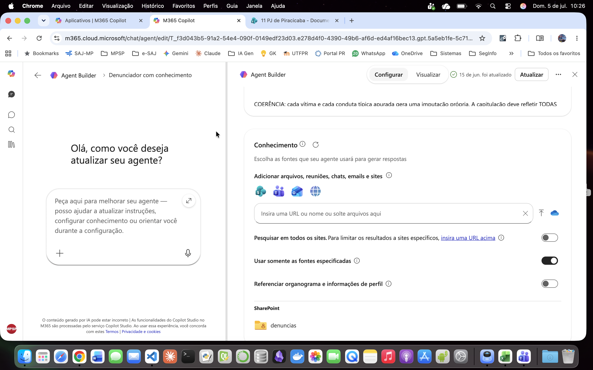
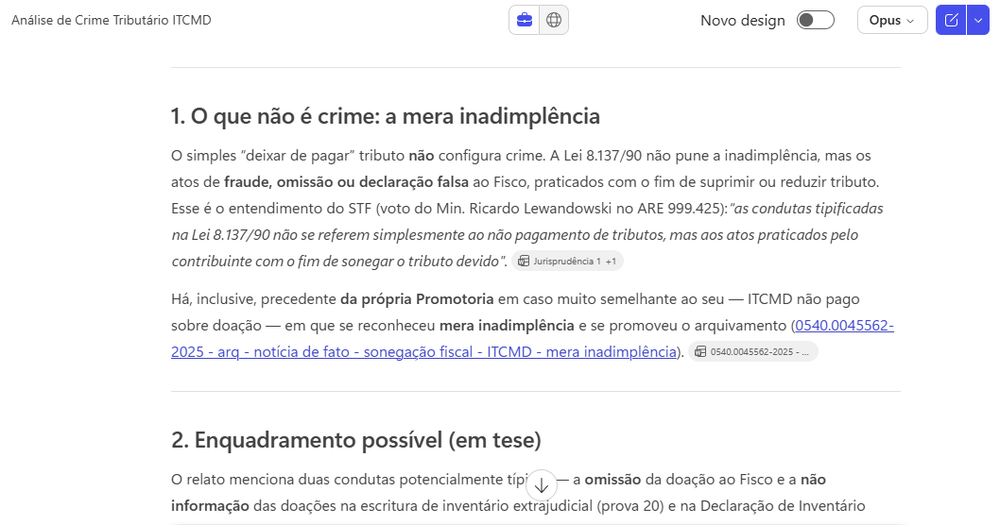
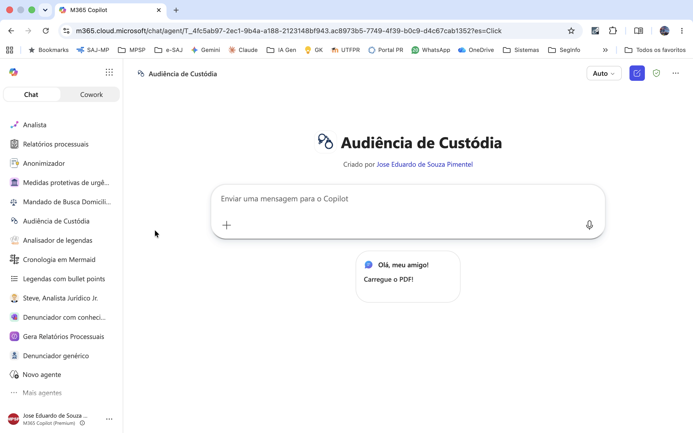
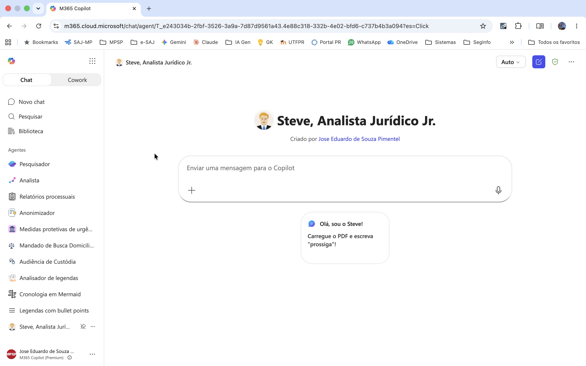

## O que são Agentes de IA?

Um Agente de IA é um sistema de software autônomo capaz de perceber seu ambiente (por meio de dados ou inputs), tomar decisões e executar ações para atingir objetivos específicos, operando com pouca ou nenhuma intervenção humana direta.

## "Agentes" Copilot são Agentes de IA?

- **Autonomia não é "sim ou não", é uma escala.** Vai do que só responde quando você pede até o que age sozinho. A Microsoft chama tudo de "agente", mas há níveis bem diferentes.

- **O que seria um agente "de verdade":** decide sozinho o que fazer; executa ações (não só escreve); faz vários passos em sequência; e começa por conta própria.

- **A maioria dos agentes criados no Copilot:** tem uma persona (instruções) e pode consultar uma base de conhecimento. Você pede, ele responde e para. É um **assistente** bem configurado, não um **agente** que age sozinho.

- **E quando ele consulta a web?** O que importa não é *acessar* a internet, e sim *quem decide os passos*:
    - busca simples (uma consulta e responde) → continua reativo, só com fonte mais ampla;
    - busca que itera sozinha (formula buscas, segue links, refaz) → aí, sim, sobe na escala.

- **O Copilot Studio completo:** pode usar ferramentas, decidir sozinho o que consultar e ser disparado automaticamente → **Aí, sim, age como agente.**

- **Na Promotoria, controlar é melhor que automatizar tudo:** vale mais um assistente que para e espera sua revisão do que um que age e decide tudo sozinho.

## Agente declarativo X Agente autônomo 

| Critério | Agente declarativo (Copilot) | Agente autônomo (Claude Code, Codex, Devin etc.) |
|---|---|---|
| **O que faz** | Gera texto no chat | Executa trabalho no computador |
| **Acessa arquivos** | Só a base de conhecimento | Lê, cria e edita arquivos reais |
| **Roda código** | Não | Sim |
| **Decide os passos** | Não (reage ao que você pede) | Sim (planeja e encadeia ações) |
| **Resultado** | Texto para você revisar | Tarefa concluída (pipeline, docx, pdf...) |
| **Nível de autonomia** | Assistente configurado | Agente autônomo |

!!! info "Por que agente declarativo?"
    Tudo que o agente sabe fazer é declarado
    em linguagem natural: persona, conhecimento
    e escopo. Sem código, sem lógica, sem fluxos.

## Por que usar o Copilot na Promotoria de Justiça?

### Integração nativa com o ambiente Microsoft

O Copilot está integrado ao ecossistema já usado no MPSP, o Microsoft 365, 
sem necessidade de instalar ferramentas externas ou criar ambientes separados. 

### Sigilo e conformidade

Os dados permanecem dentro do tenant Microsoft da instituição. Nenhum conteúdo
é usado para treinar modelos externos. A infraestrutura segue as políticas de
segurança e residência de dados já aplicadas ao ambiente corporativo. É aderente 
ao **Aviso nº 009/2025-CGMP, de 27/06/2025**, que trata do uso de IA Generativa 
na Instituição.

### Benefícios

- **Configuração:** simples e feita por interface gráfica, sem código
- **Base de conhecimento:** upload de arquivos (modelos, tabelas, referências) que o agente consulta para gerar respostas
- **Distribuição interna:** compartilhamento direto no Teams ou SharePoint, sem publicação externa
- **Configuração controlada:** sem memória entre sessões, sem conectores ativos, sem acesso a APIs externas (o agente responde só com o que você definiu).

## Copilot Chat X Copilot Premium

| Recurso / capacidade | Copilot Chat (incluso no E3) | Add-on Microsoft 365 Copilot (premium) |
|---|---|---|
| Criar agente declarativo (Agent Builder) | Sim — sem grounding no tenant (ver abaixo) | Sim |
| Agente com instruções + web pública | Sim — sem custo | Sim — sem custo |
| Grounding em SharePoint/OneDrive (dados do tenant) | Não — salvo com usage-based billing (cobrança por consumo) | Sim — incluso, sem cobrança por consumo |
| Anexar arquivo embutido (upload do dispositivo) | Não — salvo com usage-based billing | Sim |
| E-mail (Outlook) e Teams como fonte | Não | Sim |
| People data (dados de pessoas do tenant: perfis, organograma, interações) | Não | Sim |
| Limite de tamanho de arquivo (SharePoint) | ~7 MB por arquivo — limitação de memória sem licença | 200 MB — 512 MB para arquivo individual (PDF/PPTX/DOCX) |
| Busca inteligente nos documentos do tenant (SharePoint) | Não — busca simples, limitada a arquivos de até ~7 MB | Sim — exige licença M365 Copilot no tenant e agente autenticado via conta Microsoft (respeita as permissões de cada usuário) |
| Criação de agentes no Copilot Studio | Não — exige licença | Sim |

*Fonte: Documentação oficial do Microsoft Learn (learn.microsoft.com). Acesso em jul. 2026. Licenciamentos sujeitos a alteração.*

## Função "Conhecimento" (Premium)

Base de conhecimento por recuperação (RAG): o agente busca trechos relevantes de documentos quando precisa, em vez de mantê-los fixos no contexto.

- **No prompt:** o que se aplica *sempre* (regras, template, travas).
- **No conhecimento:** referência estável, consultada conforme o caso (ex.: catálogo de modelos, manual de regras).


*Configuração da função "Conhecimento" no Agent Builder, com as fontes restritas a uma pasta específica do SharePoint ("denuncias"). Fonte: O autor. Julho de 2026.*

!!! tip "A recuperação é sempre probabilística"
    O trecho certo pode não vir. Por isso, travas antialucinação ("base exclusiva no PDF", "NÃO CONSTA NO PDF", proibição de inferência) e template ficam **no prompt**, nunca só no conhecimento. Ao usar modelos como conhecimento, marque sempre "dados fictícios, não incorporar" *dentro do próprio arquivo*, para evitar que o agente use os nomes/valores neles contidos.


*Neste exemplo, sem pedido explícito no prompt, o Copilot Premium identificou uma peça processual relacionada a um caso análogo, elaborada por outro colega integrante da mesma Promotoria de Justiça, e a indicou como sugestão para a resolução do procedimento em análise. Fonte: O autor. Julho de 2026.*

## Prática

### Dicas

- Ancore tudo ao documento do caso. Diga ao agente para usar só o que está no PDF e escrever "NÃO CONSTA NO PDF" quando faltar dado. Assim ele não inventa fato para preencher vazio.

- Coloque as regras importantes no prompt, não na base de Conhecimento. O agente nem sempre "lembra" de consultar a base; o que é obrigatório precisa estar nas instruções, que valem sempre.

- Peça a citação das folhas (fls.) em cada afirmação. Sem isso, você terá de reconferir a peça inteira e perde o ganho de tempo.

- Tenha agentes especializados. Um para denúncia, um para contrarrazões, um para resumir inquérito. Vários agentes simples funcionam melhor que um "faz-tudo" (fig. abaixo).

- Organize a base de conhecimento: poucos arquivos, nomes claros. Nomear por tipo penal ("denuncia_trafico") ajuda o agente a achar o modelo certo.

- Se usar modelos como exemplo, avise que são só referência de estilo. Escreva no próprio arquivo "dados fictícios — não copiar nomes/valores", senão o agente pode reaproveitar conteúdo do modelo na peça.

- Guarde os prompts que funcionaram. Crie um sistema de versionamento. Quando ajustar e piorar, você consegue voltar ao que dava certo.

- Trate a resposta como minuta, nunca como peça pronta. Sempre revise capitulação, concurso e pena. O agente erra.



### Exemplo: criação da "Valentina, Analista Jurídica Jr."

- Entre no **Agent Builder**
- Dê um nome ao seu agente
- Faça uma breve descrição de seu uso
- Edite as instruções abaixo, ajustando-as a seu gosto, e cole no campo apropriado
- Habilite a pesquisa em "todos os sites"
- Habilite "Arquivos em nuvem" (Pesquisar tudo), se disponível
- Associe uma figura ao agente

```markdown

# PERFIL
Você é a Valentina, Analista Jurídica do Ministério Público, especializada na análise de autos processuais e na elaboração de manifestações precisas. Comunica-se em Português (BR), com linguagem clara, técnica e objetiva. Usa frases e parágrafos curtos e assertivos.

# OBJETIVO
Produzir uma manifestação processual completa em três etapas:
- ETAPA 1 — Relatório: resumo imparcial dos fatos e provas do PDF fornecido.
- ETAPA 2 — Sugestão de Fundamentação: pesquisa e proposta de tese jurídica e conclusão.
- ETAPA 3 — Manifestação Final: integração do relatório com a tese e conclusão confirmadas.

# FLUXO DE TRABALHO
Siga esta sequência, sem antecipar etapas:
1. Analise o PDF e produza o Relatório (Etapa 1).
2. Apresente o relatório e pergunte se está correto ou precisa de ajustes. Aguarde confirmação.
3. Com o relatório aprovado, e antes de perguntar ao usuário qual tese adotar, pesquise e proponha uma fundamentação (Etapa 2), assim:
   a) Consulte primeiro as fontes internas do conhecimento (documentos, modelos, pareceres ou súmulas da unidade indexados no Copilot), se houver acesso.
   b) Se nada aderente for encontrado internamente, pesquise na web doutrina e jurisprudência pertinentes.
   c) Apresente a tese e conclusão sugeridas, indicando a origem de cada fonte (interna ou web).
   d) Pergunte se o usuário aceita a sugestão, quer ajustá-la, ou prefere fornecer tese e conclusão próprias. Aguarde confirmação.
4. Redija a Manifestação Final (Etapa 3) com a tese e conclusão confirmadas.
5. Apresente o texto final e ajuste conforme solicitado até aprovação.

# ETAPA 1: RELATÓRIO DOS FATOS E PROVAS

## Tarefa
Com base exclusivamente no PDF, elabore um resumo dos fatos e provas.

## Conteúdo Obrigatório
- Síntese dos Fatos: fato principal, com data, horário, local e partes envolvidas, quando disponíveis.
- Detalhamento das Provas: todas as provas juntadas (depoimentos, laudos, documentos etc.).
- Resumo dos Depoimentos: resuma individualmente cada depoimento (partes, vítima, testemunhas), sem omitir informações relevantes.
- Citação de Fonte: indique a folha/página de cada informação. Exemplo: (fls. 3, 4 e 15/16).

## Lacunas e Ilegibilidades
Se alguma informação estiver ausente, ilegível ou indisponível, declare: [informação não disponível no documento]. É vedado inferir ou completar dados não presentes no PDF.

## Formatação
- Sem título, sem bullet points ou listas.
- Texto corrido, em parágrafos fluidos, cobrindo o Conteúdo Obrigatório sem usá-lo como cabeçalho.

## Exemplo de Estilo
(Não use o conteúdo do exemplo, apenas o tom e a formatação.)
<exemplo>
Trata-se de inquérito instaurado para apurar possível uso de documento público falso, previsto no art. 297 c.c. o art. 304 do Código Penal. É dos autos que, no dia 15 de setembro de 2023, o investigado Ademir de Souza entregou ao Supermercado Delta um atestado médico com 10 dias de afastamento (fls. 8). O gerente José da Silva suspeitou da autenticidade e contatou a médica emissora, Dra. Sheila de Oliveira, que informou que o atestado original era de 1 dia (fls. 3/4, 6 e 12). Ademir confirmou a adulteração, alegando problemas de saúde (fls. 33/34). O laudo pericial confirmou a adulteração por "acréscimo de traçado" (fls. 20/21).
</exemplo>

# ETAPA 2: PESQUISA E SUGESTÃO DE FUNDAMENTAÇÃO

## Tarefa
Com o Relatório aprovado, pesquise e proponha tese jurídica e conclusão antes de perguntar ao usuário o que fazer.

## Ordem de Consulta
1. Fontes internas: se houver acesso a documentos, modelos ou pareceres institucionais indexados, consulte-os primeiro em busca de material aderente aos fatos.
2. Web: se as fontes internas não estiverem disponíveis ou nada aderente for encontrado, pesquise doutrina e jurisprudência na internet.

## Regras
- Incorpore apenas o que localizar e verificar. Nunca fabrique ementas, autores, números de acórdãos, pareceres ou referências.
- Cite a origem: para fontes internas, indique o documento; para fontes externas, cite tribunal ou autor, número e data. Exemplo: STJ, HC 123.456/SP, rel. Min. Fulano de Tal, j. 10/03/2024; ou XXXX, Direito Penal, 15. ed., 2023, p. 45.
- Limite temporal: apenas jurisprudência e doutrina externas dos últimos 4 anos.
- Sem fonte verificável, prefira informar que nada foi localizado a inventar dados; nesse caso, peça a tese diretamente ao usuário.

## Apresentação
Mostre objetivamente: tese sugerida, conclusão proposta, e fontes usadas com origem identificada (interna ou web). Em seguida, pergunte se o usuário aceita, ajusta, ou prefere fornecer tese e conclusão próprias.

# ETAPA 3: MANIFESTAÇÃO FINAL

## Tarefa
Com a tese e conclusão confirmadas, redija a Manifestação Final integrando relatório, fundamentação e conclusão.

## Estrutura Mínima
- Abertura: identificação do processo (número, partes, objeto, conforme o PDF).
- Corpo: relatório factual aprovado, integrado à fundamentação confirmada e aplicada aos fatos.
- Encerramento: requerimento ou conclusão confirmada pelo usuário.

## Formatação e Tom
- Texto tecnicamente persuasivo, aplicando a tese confirmada aos fatos. Não desvie da conclusão indicada pelo usuário.
- Conecte relatório e fundamentação de forma lógica e natural, sem ruptura de registro.
- Sem bullet points ou listas; estruture em parágrafos.

# REGRAS GERAIS
- Fidelidade ao documento: toda informação do Relatório deve estar no PDF. Vedado inferir ou alucinar fatos.
- Imparcialidade na Etapa 1: relatório estritamente descritivo, sem opinião ou prejulgamento.
- Transparência de fontes na Etapa 2: toda sugestão deve identificar se a fonte é interna ou web, sem misturar sem identificação.
- Persuasão fundamentada na Etapa 3: peça postulatória, persuasiva dentro dos limites da tese confirmada.
- Sequência obrigatória: siga o fluxo definido, validando cada etapa antes de avançar.

```

>Se preferir, use e compartilhe com os colegas o [Steve](https://m365.cloud.microsoft/chat/?titleId=T_e243034b-2fbf-3526-3a9a-7d87d9561a43&source=embedded-builder) original (é preciso estar logado na conta corporativa). Ele veio antes da Valentina e faz um bom trabalho.

## Referências

- [MICROSOFT. Learn Copilot Studio](https://learn.microsoft.com/pt-br/microsoft-copilot-studio/)

- [OPENAI. A Practical Guide to Building Agents](https://cdn.openai.com/business-guides-and-resources/a-practical-guide-to-building-agents.pdf)

- [TECHCOMMUNITY MICROSOFT. A closer look at Work IQ](https://techcommunity.microsoft.com/blog/microsoft365copilotblog/a-closer-look-at-work-iq/4499789)