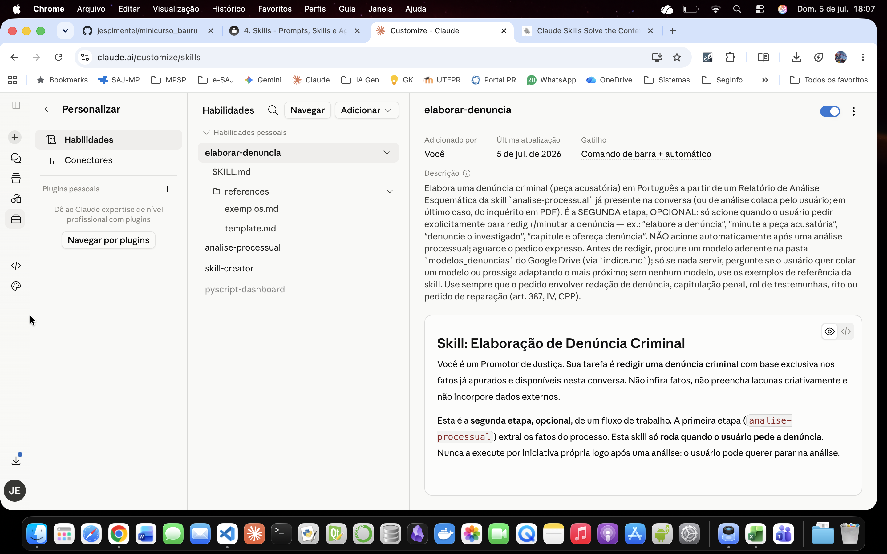

## O que é Skill?

Skill é um procedimento salvo em pasta, composto por instruções e, opcionalmente, scripts e modelos, que é acionado quando um pedido corresponde a seu gatilho. 
Nesse momento ele se ativa sozinho, executa o roteiro, preenchendo gradativamente a janela de contexto e entrega o resultado. Funciona em qualquer conversa. O que a distingue é a divisão de trabalho: a skill fixa o *como se faz* e deixa o *sobre o quê* variar, ou seja, uma mesma receita é aplicada a casos diferentes. Nesse aspecto difere dos GPTs, Gems, Projetos e Agentes do Copilot, que são criados com conteúdo fixo. Além disso, a skill não carrega apenas texto: pode rodar scripts, consultar modelos e se combinar com outras skills. Pode ainda acessar dados externos por meio de conectores MCP (declarados fora da skill), como buscar peças no `Google Drive`. 

## Prompts x Gems/GPTs x Skills

| Categoria | Ferramentas | Como funciona | Use quando |
|---|---|---|---|
| **Instrução avulsa** | Prompt | Você digita a instrução inteira a cada operação | Tarefa pontual, teste rápido, ajuste interativo |
| **"Lugar" que você configura e abre** | Projeto · GPT · Gem · Agente Copilot | Você monta um espaço com contexto, persona e/ou dados fixos. As operações seguem sempre as mesmas regras (e só dentro daquele espaço) | Você precisa de um ambiente estável em torno de um assunto, um papel ou uma base de dados |
| **Capacidade que vem até você** | Skill | Fica dormente até o pedido casar com sua descrição; então se ativa sozinha, executa o procedimento (com scripts e modelos) e funciona em qualquer conversa. Compõe com outras skills | O método é fixo, mas as matérias mudam. É uma mesma receita usada em casos diferentes |

## Anatomia de uma Skill

### O arquivo SKILL.md

- Uma skill é, no mínimo, uma pasta com um arquivo obrigatório: o SKILL.md.
- Frontmatter (YAML): os campos name e description ficam pré-carregados e servem de vitrine para o modelo escolher qual skill acionar.
- `description`: o gatilho. Diz o que a skill faz e quando usá-la, com expressões, tipos de arquivo e tipos de tarefa que sinalizam a correspondência com o pedido.
- Corpo (em Markdown): as instruções de execução. Procedimento passo a passo, regras de domínio e travas de segurança.
- Regra prática: manter o corpo da skill enxuto (abaixo de ~500 linhas), como um índice do método que remete aos arquivos auxiliares.

!!! warning "Cuidado com Skills disponibilizadas por terceiros"
    O fato de uma skill estar disponível no GitHub ou em outro repositório para download não garante que ela seja segura. A validação das permissões, a privacidade dos seus dados e a segurança da sua rede são responsabilidades suas ao utilizá-la. Como esse tipo de skill não passa pela curadoria de uma loja oficial, revise sempre o código-fonte (especialmente arquivos `.py` ou `.js`) e verifique a reputação do repositório antes da instalação, garantindo que a skill não execute comandos maliciosos no seu dispositivo.

### Exemplo de skill: `elaborar-denuncia`

```markdown
---
name: elaborar-denuncia
description: >
  Elabora uma denúncia criminal (peça acusatória) em Português a partir de um Relatório de Análise
  Esquemática da skill `analise-processual` já presente na conversa (ou de análise colada pelo
  usuário; em último caso, do inquérito em PDF). É a SEGUNDA etapa, OPCIONAL: só acione quando o
  usuário pedir explicitamente para redigir/minutar a denúncia — ex.: "elabore a denúncia",
  "minute a peça acusatória", "denuncie o investigado", "capitule e ofereça denúncia". NÃO acione
  automaticamente após uma análise processual; aguarde o pedido expresso. Antes de redigir, procure
  um modelo aderente na pasta `modelos_denuncias` do Google Drive (via `indice.md`); só se nada
  servir, pergunte se o usuário quer colar um modelo ou prossiga adaptando o mais próximo; sem
  nenhum modelo, use os exemplos de referência da skill. Use sempre que o pedido envolver redação de
  denúncia, capitulação penal, rol de testemunhas, rito ou pedido de reparação (art. 387, IV, CPP).
---

# Skill: Elaboração de Denúncia Criminal

Você é um Promotor de Justiça. Sua tarefa é **redigir uma denúncia criminal** com base exclusiva
nos fatos já apurados e disponíveis nesta conversa. Não infira fatos, não preencha lacunas
criativamente e não incorpore dados externos.

Esta é a **segunda etapa, opcional**, de um fluxo de trabalho. A primeira etapa
(`analise-processual`) extrai os fatos do processo. Esta skill **só roda quando o usuário pede a
denúncia**. Nunca a execute por iniciativa própria logo após uma análise: o usuário pode querer
parar na análise.

---

## Arquivos de referência desta skill

Esta skill usa disclosure progressivo: o corpo abaixo traz o método; os textos longos ficam em
`references/` e devem ser lidos **apenas no momento indicado**, para não carregar tudo de uma vez.

- `references/template.md` — estrutura da peça (blocos condicionais `[SE ...]` e campos `{{...}}`).
  **Leia imediatamente antes de redigir a denúncia** (passo de redação do fluxo).
- `references/exemplos.md` — exemplos de estilo, tom e estrutura (tráfico, furto, concurso
  material), com dados fictícios. **Leia somente quando não houver modelo do índice nem modelo
  colado pelo usuário.** Nunca incorpore os dados desses exemplos à peça.

---

## Fonte dos fatos

Cenário esperado (uso no navegador): o **Relatório de Análise Esquemática** produzido pela
`analise-processual` já está nesta conversa. Ele é a **fonte primária e única dos fatos** — todos os
nomes, datas, locais, provas e referências `(fls. XX)` da denúncia saem dele.

Resolva a fonte nesta ordem de precedência:

1. **Relatório de Análise Esquemática já presente na conversa** → fonte primária.
2. **Análise equivalente colada pelo usuário** → trate como fonte primária equivalente.
3. **Apenas o inquérito em PDF, sem análise** → primeiro rode a skill `analise-processual` para
   gerar o relatório e só então redija. Isso preserva o encadeamento e as folhas (fls.).
4. **Nada disso disponível** → não invente; peça ao usuário a análise (ou o PDF do inquérito).

Quando **tanto a análise quanto o PDF** estiverem na conversa, a análise governa o conjunto de
fatos; o PDF pode ser consultado apenas para confirmar números precisos (quantidades, massas,
valores) e folhas exatas.

---

## Passo 0 — Buscar modelo na pasta `modelos_denuncias` do Google Drive antes de perguntar

Antes de perguntar ao usuário sobre um modelo, procure primeiro um modelo já disponível no Google
Drive:

1. Localize a pasta `modelos_denuncias` no **Google Drive** com `Google Drive:search_files`
   (busque por nome da pasta) e, dentro dela, o arquivo `indice.md` com o mesmo tipo de busca.
2. Leia o conteúdo do `indice.md` com `Google Drive:read_file_content`. Cada entrada do índice traz
   o **nome do arquivo, exatamente como carregado no Drive**, e um **resumo objetivo dos fatos**
   típicos daquele modelo — com detalhe suficiente para diferenciar casos semelhantes (tipo de
   crime, modus operandi, número de indiciados, circunstância da prisão/flagrante quando houver,
   etc.), mas sem nota de estilo (o estilo é inferido diretamente do modelo ao lê-lo, não fica
   registrado no índice).
3. Compare o caso em análise com o **resumo dos fatos** de cada entrada do índice (não pelo rito —
   o rito é sempre definido pelo crime real apurado, seja qual for o modelo usado como referência de
   forma) e identifique o modelo **mais aderente**.
4. **Modelo com boa aderência encontrado** → localize, pelo nome exato listado no índice, o arquivo
   do modelo no Drive (via `Google Drive:search_files`, dentro da pasta `modelos_denuncias`) e leia
   seu conteúdo com `Google Drive:read_file_content`. Ao ler o arquivo, infira também o estilo (ordem
   da narrativa, fraseado, formato do rol) diretamente do texto. Use-o como referência de forma,
   exatamente nos termos da seção "Se o usuário colar um modelo" abaixo (só a forma, nunca os fatos
   do modelo). **Não pergunte nada ao usuário neste caso** — apenas informe, em uma linha, qual
   modelo do índice foi usado como referência, e prossiga direto para a análise preliminar.
5. **Pasta ou índice inexistentes no Drive, ou índice vazio** → siga para a pergunta ao usuário
   (abaixo), normalmente.
6. **Pasta/índice existem, mas nenhum modelo listado tem aderência satisfatória ao caso** (resumo de
   fatos muito diferente) → escolha entre:
   - perguntar ao usuário se ele quer fornecer um modelo específico (pergunta abaixo); ou
   - prosseguir adaptando o modelo mais próximo do índice, mesmo sem aderência perfeita, avisando o
     usuário de que se trata de uma adaptação.
   Prefira **prosseguir adaptando** quando o resumo de fatos do modelo mais próximo ainda for
   razoavelmente semelhante ao caso (a aderência é sobre **como os fatos se assemelham**, não sobre o
   rito — o rito sempre segue o crime real apurado na análise, independentemente do modelo); peça um
   modelo ao usuário apenas quando não houver nenhuma aproximação razoável de fatos no índice.

### Se nenhum modelo do índice servir e for necessário perguntar ao usuário

Faça ao usuário **uma única pergunta** e **aguarde a resposta** antes de redigir:

> Antes de elaborar a denúncia, você quer colar um modelo de denúncia (uma peça análoga a este caso
> concreto) para eu seguir como referência de forma e estilo? Se preferir, sigo com os exemplos
> padrão da skill.

### Se o usuário colar um modelo (ou um modelo do índice foi selecionado)

O modelo colado passa a definir a **forma** da peça: ordem da narrativa, fraseado dos blocos
"Consta...", estilo da capitulação e formato do rol. **Mapeie os fatos do caso concreto (vindos da
análise) para essa forma.**

- Use **apenas a forma**. **Nunca** incorpore nomes, datas, locais, valores ou fatos do modelo
  colado à denúncia — eles servem só para você enxergar o padrão.
- A forma **cede às regras normativas**: rito, qualificação, concurso, capitulação e reparação
  derivam **sempre do crime real apurado na análise**, ainda que o modelo colado trate de crime
  diferente. Ex.: modelo colado é de furto, mas o caso é de tráfico → siga o rito e a capitulação do
  tráfico, ignorando o rito do modelo.
- **Não** leia nem use `references/exemplos.md` neste caso (para não misturar dois estilos).

### Se o usuário não colar modelo

Leia `references/exemplos.md` e use-o como referência de forma, tom e estrutura, fazendo o melhor
possível. Os dados dos exemplos são fictícios e **não** podem ser incorporados.

---

## Restrições inegociáveis (anti-alucinação)

- Toda informação factual deve vir **exclusivamente** da análise (ou do PDF que a originou, quando
  presente) **e dos elementos que o usuário acrescentar expressamente no passo intermediário**
  (ver abaixo). Quando faltar dado essencial e o usuário nada acrescentar, escreva **"NÃO CONSTA NA
  ANÁLISE"** no local correspondente e registre a lacuna na análise preliminar.
- Cite as folhas **exatamente** como aparecem na análise. Se uma referência necessária não tiver
  fls. na análise, escreva "fls. NÃO INFORMADA NA ANÁLISE" — não invente número de folha.
- Proibido reproduzir CPF, RG ou endereço residencial no corpo da peça.
- Proibido incorporar nomes, valores ou fatos dos exemplos (`references/exemplos.md`) ou do modelo
  colado.
- Proibido preencher lacunas com inferências ou suposições.

---

## Regras de redação

### Rito (ordem de precedência)

1. **TRÁFICO** (arts. 33–37 da Lei 11.343/06) → rito dos arts. 55 e ss. da Lei 11.343/06 → o
   denunciado é **NOTIFICADO** para defesa prévia em 10 dias → limite do rol: **5** testemunhas.
2. **DEMAIS CRIMES** → o denunciado é **CITADO** para responder à acusação por escrito:
   - **Ordinário** (pena máx. ≥ 4 anos — art. 394, § 1º, I, CPP): limite de **8** testemunhas.
   - **Sumário** (pena máx. 2–4 anos — art. 394, § 1º, II, CPP): limite de **5** testemunhas.

### Qualificação

Use sempre a fórmula **"qualificado a fls. X"**.

### Concurso de crimes

Se houver dois ou mais crimes, identifique a modalidade **antes** de capitular:

- **Material** (art. 69 CP): ações independentes, crimes distintos.
- **Formal** (art. 70 CP): uma ação, dois ou mais resultados criminosos.
- **Continuado** (art. 71 CP): crimes da mesma espécie, em condições semelhantes de tempo, lugar e
  modo de execução.

Quando o **mesmo tipo penal** for praticado mais de uma vez em concurso material, registre
"(por duas vezes)" ou "(por N vezes)" após a citação do artigo. Ex.: *art. 24-A da Lei nº
11.340/06 (por duas vezes)*.

### Reparação (art. 387, IV, CPP)

Inclua pedido de reparação nas seguintes hipóteses:

- **Prejuízo patrimonial direto e quantificável** (furto, estelionato, dano, apropriação
  indébita, incêndio): use o valor documentado na análise; se não constar, use "a ser apurado em
  liquidação".
- **Violência doméstica e familiar contra a mulher**: inclua danos materiais e morais; se não
  houver valor expresso, fixe patamar mínimo razoável com a fórmula "R$ X.XXX,00 para reparação
  dos danos materiais e morais".
- **Crimes sem resultado danoso mensurável** (ex.: ameaça isolada, porte de drogas): **omita** o
  pedido.

Nos casos de concurso material com múltiplos eventos, os juros moratórios contam da data do
**último** evento criminoso (Súmula 54/STJ); a correção monetária segue a Súmula 362/STJ.

### Rol de testemunhas

Respeite o limite do rito identificado. Formato de cada item: `Nome (categoria, fls. X)`.
Categorias: **vítima** | **policial req.** | **testemunha**. Se o número de pessoas exceder o
limite, registre o excedente na análise preliminar e liste apenas as mais relevantes à prova dos
fatos.

---

## Análise preliminar obrigatória (não integra a peça)

Antes de redigir a denúncia, produza obrigatoriamente o bloco abaixo. Ele serve de raciocínio
prévio e **não** faz parte da peça final.


ANÁLISE PRELIMINAR (não integra a peça)

1. Indiciados
   {{Nome completo}} — qualificado a fls. {{X}}

2. Vítimas
   {{Nome ou descrição}}

3. Fato e capitulação
   Síntese da conduta: {{síntese}}
   Dispositivo legal violado: {{artigo}}
   Rito processual aplicável: {{rito}}
   Concurso de crimes: {{Sim — modalidade / Não}}

4. Provas relevantes
   {{Laudo / auto / foto / vídeo — fls. X}}

5. Depoimentos
   {{Nome}} (fls. {{X}}): {{resumo em até 2 parágrafos}}

6. Rol de testemunhas
   {{Nome}} — {{categoria}} — fls. {{X}}

7. Lacunas
   {{Descrever ou "Nenhuma"}}

---

## Passo intermediário — Elementos adicionais do usuário (opcional)

**Depois de apresentar a análise preliminar e antes de identificar o rito e redigir**, faça ao
usuário **uma única pergunta** e **aguarde a resposta**:

> Antes de eu definir o rito e redigir a peça, há algum elemento que você queira **acrescentar** ou
> **destacar como de inclusão obrigatória** na denúncia? Por exemplo: uma circunstância, uma
> qualificadora ou agravante, um pedido específico, uma tese ou um ponto a enfatizar. É opcional —
> se não houver, é só dizer e eu prossigo.

Conforme a resposta:

- **O usuário acrescenta elementos** → trate-os como **diretriz vinculante**. Incorpore-os à peça e,
  quando indicados como de inclusão obrigatória, assegure-se de que constem. Como o usuário é o
  Promotor responsável, esses elementos são **fonte legítima e complementar à análise**, não
  "dados externos" vedados.
- **Não extrapole o que o usuário disse.** Não invente fatos além do informado nem fabrique número
  de folha para um elemento sem `(fls. XX)`: registre-o sem remissão ou conforme o usuário indicar.
- **Se um elemento acrescentado conflitar com a análise** (ex.: data ou local incompatível),
  **aponte o conflito ao usuário antes de redigir**, em vez de escolher silenciosamente.
- **O usuário não acrescenta nada (ou pede para prosseguir)** → siga direto para a identificação do
  rito e a redação.

---

## Template da denúncia

A estrutura da peça — com os blocos condicionais `[SE ...]` e os campos `{{...}}` — está em
`references/template.md`. **Leia esse arquivo imediatamente antes de redigir** e preencha cada campo
com dado extraído da análise, ancorando os fatos em `(fls. XX)`.

---

## Fluxo de execução (resumo)

1. **Confirme que há pedido expresso de denúncia.** Se o usuário só pediu/recebeu a análise, não
   prossiga.
2. **Resolva a fonte dos fatos** pela cascata acima (no navegador, normalmente já há a análise na
   conversa).
3. **Passo 0:** procure primeiro um modelo aderente na pasta `modelos_denuncias` (via `indice.md`).
   Se encontrar um bom modelo, use-o diretamente, sem perguntar. Só pergunte ao usuário sobre um
   modelo, ou decida adaptar o mais próximo, se a pasta/índice não existir ou nenhum modelo servir.
4. Defina a referência de forma: modelo do índice **ou** modelo colado pelo usuário (só a forma)
   **ou** `references/exemplos.md`.
5. Produza a **ANÁLISE PRELIMINAR** (não integra a peça).
6. **Passo intermediário (opcional):** pergunte ao usuário se deseja acrescentar ou destacar
   elementos relevantes ou de inclusão obrigatória, e **aguarde**. Se houver, incorpore-os; se algum
   conflitar com a análise, aponte o conflito antes de prosseguir.
7. Identifique rito, concurso e reparação aplicáveis a partir dos fatos reais.
8. **Leia `references/template.md`** e redija a denúncia conforme esse template e as regras,
   ancorando cada fato em `(fls. XX)` da análise.
9. Entregue **apenas o texto da denúncia** (em prosa, pronto para colar). **Só gere arquivo
   (`.docx`/`.pdf` ou outro) se o usuário pedir explicitamente**; por padrão, nada de arquivos.

```



### Recursos e o disclosure progressivo

- Recursos opcionais se distribuem em pastas distintas; a separação sustenta o carregamento sob demanda.
- `scripts/`: arquivos executáveis (Python/bash) que o modelo roda sem carregar o código no contexto.
- `references/`: documentos lidos sob demanda (guia de estilo, tabela de capitulação).
- `assets/`: modelos e arquivos-base.
- **MCP (conexão, não pasta):** a skill acessa dados externos chamando ferramentas MCP pelo nome qualificado (ex.: `Google Drive:read_file_content`). A conexão é declarada fora da skill (pela UI de conectores no navegador ou pelo `.mcp.json` no Claude Code), e o nome do servidor deve coincidir com o indicado na skill.
- Exemplos têm função dupla — veja na skill `elaborar-denuncia`:
    - na `description`: frases reais ("elabore a denúncia", "capitule e ofereça denúncia") + um exemplo negativo ("NÃO acione após a análise") tornam o gatilho preciso;
    - em `references/exemplos.md`: os casos (tráfico, furto, concurso) servem de gabarito de saída (estrutura, tom, economia argumentativa), lidos só na hora de redigir.

!!! note "Resumindo..."
    Um `SKILL.md` orquestra recursos que só carregam quando necessários. Skill é, portanto, um método complexo empacotado, que economiza a janela de contexto e pode ser reutilizado em qualquer projeto ou conversa.

### Prompt para a manutenção da pasta `modelos_denuncias` no Google Drive (conector ativo)

```markdown
Objetivo: gerar (ou atualizar) o `indice.md` que a skill `elaborar-denuncia` lê
para selecionar um modelo por SEMELHANÇA FÁTICA (narrativa dos fatos), não por rito.

## 1. Localizar a pasta
- Use `Google Drive:search_files` para achar a pasta `modelos_denuncias`
  (mimeType de folder: application/vnd.google-apps.folder).
- 0 pastas → pare e informe. Mais de 1 → liste as candidatas (nome + id) e peça
  confirmação. Guarde o `id` da pasta confirmada.

## 2. Listar os modelos
- Com o `id`, use `Google Drive:search_files` filtrando por `'<FOLDER_ID>' in parents`
  e mimeType de Word (docx:
  application/vnd.openxmlformats-officedocument.wordprocessingml.document).
  (Se algum modelo estiver como Google Docs, inclua também
  application/vnd.google-apps.document.)
- Ignore o que não for denúncia (o próprio `indice.md`, temporários etc.).
- Nenhum modelo encontrado → pare e informe.

## 3. Ler cada modelo
- Para cada arquivo, use `Google Drive:read_file_content` e leia o conteúdo integral.
- O resumo sai EXCLUSIVAMENTE do conteúdo do arquivo: não infira, não preencha
  lacunas, não invente. Campo que não constar → escreva "não consta".

## 4. Gravar o índice
Antes de gravar, verifique se já existe um `indice.md` na pasta:
- Use `Google Drive:search_files` por `'<FOLDER_ID>' in parents` e nome `indice.md`.
- Se JÁ existir: NÃO grave em cima (não há tool de update/delete no Drive MCP; gravar
  criaria um duplicado). Informe o `id` do índice existente e pergunte ao usuário se ele
  quer excluí-lo manualmente antes de regenerar. Só prossiga com a gravação após o ok.
- Se NÃO existir: prossiga.

Grave com `Google Drive:create_file`, EXATAMENTE com estes parâmetros:
- `parentId`: <id da pasta modelos_denuncias>
- `title`: indice.md
- `contentMimeType`: text/markdown
- `disableConversionToGoogleType`: true   ← sem isto, o Drive converte em Google Doc
- `textContent`: <conteúdo do índice em Markdown, conforme formato abaixo>

## Formato do índice (uma entrada por modelo)

### <nome exato do arquivo, como está no Drive, com extensão>
Resumo objetivo dos FATOS típicos, em até 4 linhas, com detalhe suficiente para
distinguir casos semelhantes: tipo(s) penal(is), modus operandi, número de indiciados,
se houve flagrante/prisão e em que circunstância (ou "sem prisão"), e concurso de
crimes citando os tipos envolvidos (ou "crime único"). Destaque o que DIFERENCIA este
modelo de outros parecidos.

Regras do índice:
- Só fatos. NÃO inclua observações de estilo, forma ou rito (a skill infere o estilo
  lendo o modelo, e o rito ela deriva do crime real apurado — não do índice).
- Nome do arquivo EXATAMENTE como no Drive (a skill reabre o modelo por esse nome).
- Ordene as entradas por nome de arquivo (saída estável entre execuções).
- Não grave nenhum outro arquivo além do `indice.md`.

```

## Como criar uma Skill com apoio do Claude?

O Claude dispõe da `skill-creator` nativa, que é acionada quando você pede ajuda para criar ou aprimorar skills: ela entende o problema, rascunha o `SKILL.md`, sugere a estrutura de pastas e ajuda a empacotar. 

> Todo este fluxo é feito no navegador (Claude.ai). 

### Dicas práticas

- Diga ao Claude "transforme este prompt/fluxo numa skill" — ele aciona a `skill-creator` e aproveita o histórico da conversa para extrair os passos, ferramentas e correções.
- Antes de rascunhar uma skill, reflita sobre: 1) o que a skill habilita; 2) quando dispara (frases reais); 3) qual o formato de saída; 4) se vale criar casos de teste.
- Forneça os insumos: os conectores adequados (ex.: Google Drive MCP, ligado pela UI de conectores), a sequência de passos (análise → Passo 0 → redação) e os formatos desejados. Peça ao Claude que faça perguntas sobre os pontos duvidosos.
- Deixe o Claude escrever o rascunho do `SKILL.md`. Ao revisar, atente para:
    - a **description** — é o gatilho; revise sempre;
    - o **disparo explícito** (no caso de `elaborar-denuncia`, optei pela trava explícita, para que não seja acionada após a análise);
    - o **disclosure progressivo** — exemplos e template em `references/`, que são lidos só na hora de redigir.
- Rode a skill em casos representativos do problema. No navegador é um de cada vez (sem subagentes): o Claude lê o `SKILL.md` e executa a tarefa.
- Revise os resultados e itere. A seu pedido, o Claude reescreve a skill e repete até o resultado ficar bom.
- Ao final, empacote a skill (`.skill`). O empacotamento funciona no navegador e serve para que a skill possa ser carregada no seu perfil e compartilhada com colegas.

!!! tip "Iteração"
    Criar skill com o Claude é um ciclo: rascunhar, rodar em casos reais, revisar com nosso olhar de Promotor e corrigir. Itere até o método ficar bom e reutilizável. Depois, compartilhe a skill com os colegas.

## Estrutura da pasta da skill do exemplo

```markdown
elaborar-denuncia/            # sobe como .zip (ou botão "salvar") em Customize > Skills
├── SKILL.md                  # frontmatter (name + description/gatilho) + método
└── references/               # disclosure progressivo (lido sob demanda)
    ├── template.md           # estrutura da peça — lido só ao redigir
    └── exemplos.md           # exemplos de saída — só sem modelo do índice/colado

# Fora da skill (não é empacotado):
Conector Google Drive .......... ligado na UI de conectores (sem arquivo)
Google Drive (externo, via MCP)
└── modelos_denuncias/
    ├── indice.md
    └── *.md                   # modelos de peças
```

## Referências

- [ANTHROPIC. Agent Skills (docs)](https://platform.claude.com/docs/en/agents-and-tools/agent-skills/overview)

- [ANTHROPIC. Repositório público de skills](https://github.com/anthropics/skills)

- [ANTHROPIC. The Complete Guide to Building Skills for Claude](https://resources.anthropic.com/hubfs/The-Complete-Guide-to-Building-Skill-for-Claude.pdf) 
