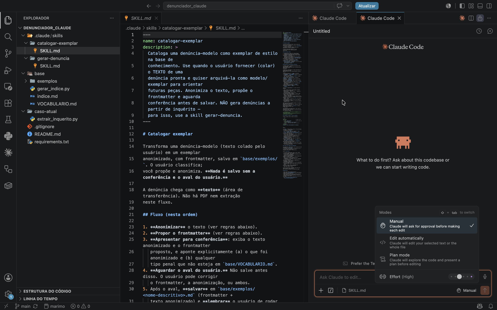
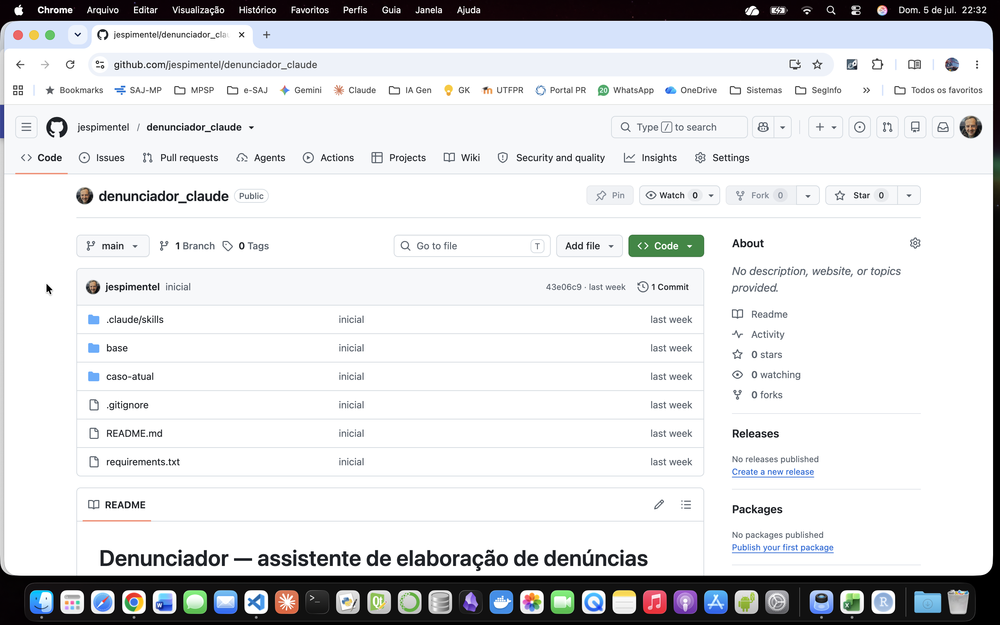

## Visão geral

A extensão oficial coloca o Claude Code dentro do VS Code, sem precisar usar o terminal. Ela aparece num painel lateral e mostra, em tempo real, as mudanças que o Claude propõe: cada alteração vem lado a lado (o texto atual e o novo), e você decide item a item se aceita, recusa ou pede um ajuste. Há dois modos de trabalho. No modo normal, o Claude pede sua confirmação a cada mudança. No modo de planejamento, ele primeiro apresenta um plano completo, que você lê e comenta antes de autorizá-lo a começar. Na prática, o Claude atua sobre os arquivos do seu projeto: lê, edita, cria pequenos programas e executa tarefas por conta própria, sempre sob seu controle. Também pode se conectar a fontes externas (como o seu Google Drive) para buscar informação enquanto trabalha. É o ambiente indicado para quem quer construir e organizar ferramentas com mais controle

## Claude.ai X Cowork X VS Code (com extensão do Claude)

<table>
  <thead>
    <tr>
      <th>Critério</th>
      <th>Claude.ai</th>
      <th>Cowork</th>
      <th>VS Code (Extensão do Claude)</th>
    </tr>
  </thead>
  <tbody>
    <tr>
      <td><strong>Interface</strong></td>
      <td>Navegador e app desktop (formato chat)</td>
      <td>App desktop com GUI (aba dentro do Claude Desktop)</td>
      <td>Painel integrado à IDE e terminal</td>
    </tr>
    <tr>
      <td><strong>Público-alvo</strong></td>
      <td>Uso geral</td>
      <td>Não-desenvolvedores (você descreve o resultado e o Claude executa)</td>
      <td>Desenvolvedores e usuários avançados</td>
    </tr>
    <tr>
      <td><strong>Instalação / Onde a skill vive</strong></td>
      <td>Na conta do usuário (upload do .zip em Customize -> Skills)</td>
      <td>Mesma conta (sincroniza Web e Desktop) ou via plugins</td>
      <td>Localmente no disco, no arquivo .claude/skills/ (sem upload)</td>
    </tr>
    <tr>
      <td><strong>Execução de código</strong></td>
      <td>Sandbox (VM) em nuvem da Anthropic</td>
      <td>VM isolada na máquina do usuário, separada do SO</td>
      <td>Máquina real e terminal local do usuário</td>
    </tr>
    <tr>
      <td><strong>Acesso a arquivos</strong></td>
      <td>Apenas arquivos da conversa e conectores ativos</td>
      <td>Apenas pastas explicitamente autorizadas pelo usuário</td>
      <td>Acesso direto ao filesystem do projeto aberto</td>
    </tr>
    <tr>
      <td><strong>MCP (ex. Google Drive)</strong></td>
      <td>Conector nativo pela interface (UI)</td>
      <td>Conector nativo pela interface (mesmas permissões do chat)</td>
      <td>Configurado via .mcp.json ou claude mcp add</td>
    </tr>
    <tr>
      <td><strong>Criação e otimização de skill</strong></td>
      <td>Via skill-creator com ciclo manual (rascunhar, rodar, revisar)</td>
      <td>Usa skills e plugins existentes; não há ciclo de otimização</td>
      <td>Via skill-creator com otimização automática de gatilhos e testes</td>
    </tr>
    <tr>
      <td><strong>Compartilhamento</strong></td>
      <td>Recursos padrão de compartilhamento da conta do produto</td>
      <td>Plugins (skills, conectores, subagentes) e tarefas agendadas</td>
      <td>Controle de versão via Git</td>
    </tr>
    <tr>
      <td><strong>Melhor para</strong></td>
      <td>Redigir, resumir e iterar textos ou ideias no dia a dia</td>
      <td>Automação de tarefas multi-etapa com arquivos locais (sem código)</td>
      <td>Construir, testar e versionar skills e pipelines locais em Python</td>
    </tr>
  </tbody>
</table>

## Trabalhando no VS Code

### Instalação e Configuração Inicial

*   **Instalação da Extensão:** 
    *   Abra o VS Code, vá até o menu de Extensões (`Ctrl+Shift+X` ou `Cmd+Shift+X`).
    *   Pesquise por **Claude** (oficial da Anthropic) e clique em **Install**.
*   **Autenticação da Conta:**
    *   Clique no ícone do Claude que apareceu na barra lateral esquerda.
    *   Selecione **Sign In** para conectar sua conta Anthropic ou insira sua chave de API nas configurações.
*   **Permissões de Workspace:**
    *   Abra a pasta do seu projeto (`File > Open Folder`).
    *   O Claude solicitará permissão para ler o diretório local; autorize para ativar o contexto completo do projeto.
*   **Ativação do Ambiente Local:**
    *   Abra o terminal integrado do VS Code (`Ctrl+``).
    *   O Claude usará este terminal para executar testes e comandos em sua máquina real sempre que você autorizar.

### Criação de Skills e Execução Automatizada

*   **Utilizando o Skill Creator:**
    *   No painel do Claude, peça para criar uma automação ou rotina usando o comando de criação.
    *   O assistente criará automaticamente um arquivo de skill dentro do diretório oculto `.claude/skills/`.
*   **Otimização e Testes Automáticos:**
    *   O Claude gerencia o ciclo completo localmente: ele rascunha o código em Python, cria gatilhos automáticos e roda subagentes no seu terminal para validar se tudo funciona.
*   **Gerenciamento de Ferramentas (MCP):**
    *   Para conectar ferramentas externas (como o Google Drive), configure o arquivo `.mcp.json` na raiz do projeto ou utilize o terminal com o comando `claude mcp add`.
*   **Versionamento e Compartilhamento:**
    *   Como todas as suas skills e pipelines ficam salvos em arquivos locais no seu filesystem, basta usar o **Git** para commitar, versionar e compartilhar as automações com o restante da sua equipe.



## Exemplo didático de um repositório no GitHub (para versionamento)

Acesse o repositório [**denunciador-claude**](https://github.com/jespimentel/denunciador_claude) no GitHub (criado somente para fins didáticos - não foi testado em produção)



## Estrutura de um projeto com MCP no VS Code

```markdown
denunciador/                          # raiz do projeto (versionável no git)
├── .mcp.json                         # declara o servidor "Google Drive" (chave = prefixo da skill)
├── .claude/
│   ├── settings.json                 # (opcional) auto-aprova o servidor do .mcp.json
│   └── skills/
│       └── elaborar-denuncia/
│           ├── SKILL.md
│           └── references/
│               ├── template.md
│               └── exemplos.md

# Fora do repositório (não versionado):
Google Drive (externo, via MCP)
└── modelos_denuncias/
    ├── indice.md
    └── *.md                          # modelos de peças
```
- Exemplo do arquivo .mcp.json (declara a existência de um servidor MCP)

```json
{
  "mcpServers": {
    "Google Drive": {
      "type": "http",
      "url": "https://<endpoint-do-conector-google-drive>"
    }
  }
}
```

- Exemplo de arquivo settings.json  (habilita o servidor MCP)

```json
{
  "enabledMcpjsonServers": ["Google Drive"]
}
```

## Referências

- [ANTHROPIC. Extensão no Marketplace](https://marketplace.visualstudio.com/items?itemName=Anthropic.claude-code)

- [ANTHROPIC. Claude Code Docs](https://docs.anthropic.com/en/docs/claude-code)

- [OPENAI. MCP no Apps SDK](https://developers.openai.com/apps-sdk/concepts/mcp-server)